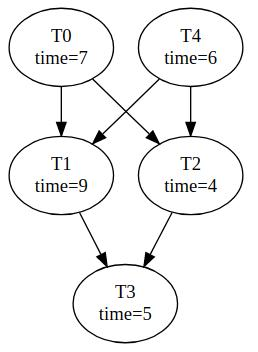

`n = number_of_tasks`
`e = number_of_edges`
`p = number_of_processors`

Tasks are numbered `0` to `n-1`.

Input Format:
```
n e p
n numbers in one line denoting time taken by tasks 0 to n-1
e lines each containing "u v" denoting edge from task u to task v (0<=u,v<=n-1)
```
For example:
```
5 6 4
7 9 4 3 6
0 1
0 2
4 1
4 2
1 3
2 3
```
represents the following task graph with `p = 4`:


